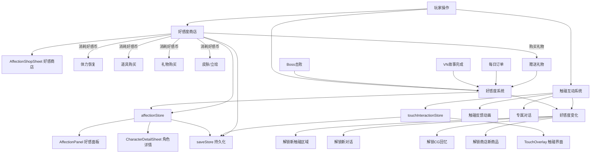
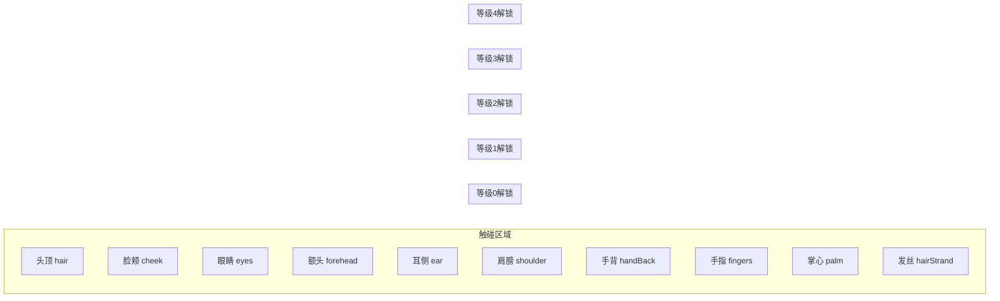
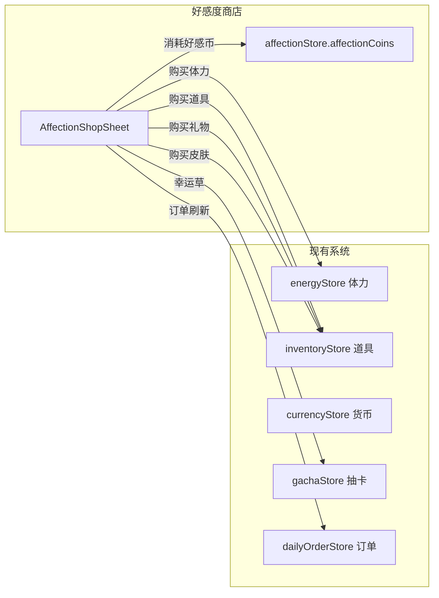
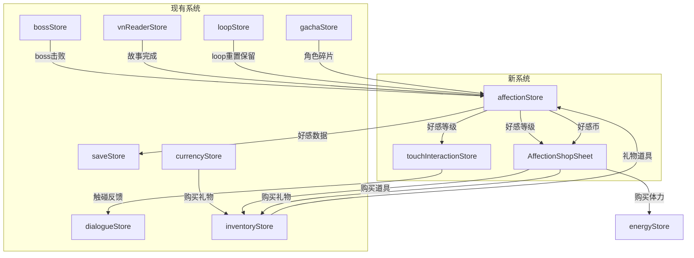

# 好感度系统 & 触碰互动系统 & 好感度商店 — 架构设计

## 一、系统概览

### 1.1 四位男主（学园设定）

| ID        | 姓名   | 色系         | 性格关键词          | 恋爱签名                                     |
| --------- | ------ | ------------ | ------------------- | -------------------------------------------- |
| `morven`  | 林墨白 | #7B68EE 紫   | 冷淡→温柔、外冷内热 | 不解释的守护——把世界调整成她能自由行动的形状 |
| `daniel`  | Daniel | #4169E1 蓝   | 活泼热情、阳光直率  | 笑着靠近——用快乐制造她无法拒绝的停留         |
| `vincent` | 司徒渊 | #483D8B 暗紫 | 严肃克制、罕见柔和  | 秩序中的例外——所有规则在她面前都多一条注释   |
| `leo`     | 陆之昂 | #FF6347 红   | 傲娇毒舌、推眼镜    | 毒舌下的在意——越在意越不肯好好说话           |

### 1.2 系统关系图



---

## 二、好感度系统设计

### 2.1 好感等级

| 等级 | 名称   | 积分区间    | 解锁内容                               |
| ---- | ------ | ----------- | -------------------------------------- |
| 0    | 陌生人 | 0 - 99      | 基础触碰区域：头顶、肩膀               |
| 1    | 熟识   | 100 - 299   | 解锁触碰：脸颊、手背；解锁日常对话变体 |
| 2    | 好友   | 300 - 599   | 解锁触碰：眼睛、手指；解锁角色小故事   |
| 3    | 暧昧   | 600 - 999   | 解锁触碰：额头、耳侧；解锁专属约会场景 |
| 4    | 心动   | 1000 - 1499 | 解锁触碰：掌心、发丝；解锁亲密对话     |
| 5    | 牵绊   | 1500+       | 全区域解锁；解锁专属结局线索           |

### 2.2 好感度来源与数值

| 来源              | 单次获得 | 频率限制                  | 备注             |
| ----------------- | -------- | ------------------------- | ---------------- |
| Boss击败对话      | 15-30    | 每次击败                  | 根据loop层级递增 |
| VN故事完成        | 20-50    | 每次完成                  | SSR故事给更多    |
| 触碰互动          | 1-8      | 每区域3秒CD，每日最多五次 | 高等级区域给更多 |
| 每日订单-角色相关 | 10-20    | 每日                      | 订单关联特定角色 |
| 赠送礼物          | 5-50     | 无限制                    | 消耗道具/货币    |
| 特殊事件          | 30-100   | 一次性                    | 剧情关键节点     |

### 2.3 affectionStore 设计

```typescript
// src/stores/affectionStore.ts

interface AffectionState {
  // characterId -> affection points
  affection: Record<string, number>;
  // characterId -> set of unlocked interaction IDs
  unlockedInteractions: Record<string, string[]>;
  // characterId -> giftId -> total count gifted
  giftHistory: Record<string, Record<string, number>>;
  // characterId -> last touch timestamp per zone (for cooldown)
  lastTouchTime: Record<string, Record<string, number>>;
}

// Key computed properties:
// - getLevel(characterId): number — current affection level 0-5
// - getLevelName(characterId): string — localized level name
// - getLevelProgress(characterId): number — 0-1 progress within current level
// - getUnlockedZones(characterId): string[] — touch zones available
// - isInteractionUnlocked(characterId, interactionId): boolean

// Key actions:
// - addAffection(characterId, amount, source): void
// - giftItem(characterId, giftId): boolean
// - unlockInteraction(characterId, interactionId): void
// - recordTouch(characterId, zoneId): void
// - serialize() / deserialize(data): persistence
```

### 2.4 好感度事件总线

```typescript
// 新增事件
globalBus.emit("affection:changed", { characterId, delta, source });
globalBus.emit("affection:levelUp", { characterId, newLevel, oldLevel });
globalBus.emit("affection:interactionUnlocked", { characterId, interactionId });
```

---

## 三、触碰互动系统设计

### 3.1 触碰区域定义

每位角色拥有相同的区域框架，但对话和动画因人而异：



### 3.2 触碰反馈设计

每次触碰产生三层反馈：

1. **即时视觉反馈**：触碰点涟漪粒子 + 角色表情微变
2. **对话气泡**：角色专属反应台词（根据好感等级不同）
3. **好感度数值**：+1~8 浮动数字动画

#### 角色反应示例 — 林墨白（Morven）

| 区域 | Lv.0 陌生人       | Lv.2 好友                 | Lv.4 心动                   |
| ---- | ----------------- | ------------------------- | --------------------------- |
| 头顶 | 「……别碰。」+后退 | 「……算了，随你。」+别开眼 | 「……再摸一下。」+闭眼       |
| 脸颊 | 🔒未解锁          | 「你手很凉。」+微偏头     | 「只有你可以。」+轻蹭手心   |
| 手指 | 🔒未解锁          | 「……干嘛。」+没抽手       | 「你的手……很暖。」+扣住手指 |
| 掌心 | 🔒未解锁          | 🔒未解锁                  | 「别松手。」+收紧           |

#### 角色反应示例 — Daniel

| 区域 | Lv.0 陌生人          | Lv.2 好友                   | Lv.4 心动                       |
| ---- | -------------------- | --------------------------- | ------------------------------- |
| 头顶 | 「Hey！你干嘛！」+笑 | 「哈哈，再摸啊！」+主动凑近 | 「你的手好适合放这。」+低头     |
| 脸颊 | 🔒未解锁             | 「我的脸很好看对吧？」+眨眼 | 「……别停。」+耳红               |
| 手指 | 🔒未解锁             | 「来，击个掌！」+击掌       | 「这次不击掌了……」+十指相扣     |
| 掌心 | 🔒未解锁             | 🔒未解锁                    | 「我手心在出汗……因为你。」+握紧 |

#### 角色反应示例 — 司徒渊（Vincent）

| 区域 | Lv.0 陌生人           | Lv.2 好友                 | Lv.4 心动                     |
| ---- | --------------------- | ------------------------- | ----------------------------- |
| 头顶 | 「这不合规矩。」+退后 | 「……仅此一次。」+不动     | 「你是我唯一的例外。」+放松   |
| 脸颊 | 🔒未解锁              | 「注意分寸。」+但没躲     | 「分寸……对你不适用。」+轻叹   |
| 手指 | 🔒未解锁              | 「这是工作场合。」+没放手 | 「规矩改了——因为你。」+反握   |
| 掌心 | 🔒未解锁              | 🔒未解锁                  | 「我从未为任何人破例。」+紧扣 |

#### 角色反应示例 — 陆之昂（Leo）

| 区域 | Lv.0 陌生人                 | Lv.2 好友                   | Lv.4 心动                     |
| ---- | --------------------------- | --------------------------- | ----------------------------- |
| 头顶 | 「喂！你手不干净吧！」+拍掉 | 「……哼，就一下。」   | 「……再碰就收不回来了。」+红耳 |
| 脸颊 | 🔒未解锁                    | 「你、你干嘛啊！」+偏头     | 「……笨蛋，别看。」+没躲       |
| 手指 | 🔒未解锁                    | 「别碰我手！……好吧。」+僵住 | 「你的手……怎么这么小。」+包住 |
| 掌心 | 🔒未解锁                    | 🔒未解锁                    | 「我、我才没紧张……」+手心出汗 |

### 3.3 触碰动画系统

| 动画类型      | 触发条件       | 效果           |
| ------------- | -------------- | -------------- |
| `ripple`      | 所有触碰       | 触碰点扩散涟漪 |
| `pull_back`   | Lv.0 触碰      | 角色后退/躲开  |
| `surprise`    | 首次触碰新区域 | 角色惊讶表情   |
| `look_away`   | Lv.1-2 触碰    | 角色别开眼     |
| `soft_smile`  | Lv.3 触碰      | 角色柔和微笑   |
| `close_eyes`  | Lv.4 触碰      | 角色闭眼享受   |
| `lean_in`     | Lv.5 触碰      | 角色主动靠近   |
| `heart_float` | 好感+5以上     | 心形粒子上浮   |
| `sparkle`     | 解锁新区域     | 星光闪烁特效   |

### 3.4 touchInteractionStore 设计

```typescript
// src/stores/touchInteractionStore.ts

interface TouchInteractionState {
  // Currently active character for touch
  activeCharacterId: string | null;
  // Whether touch overlay is open
  isOverlayOpen: boolean;
  // Cooldown tracking: characterId -> zoneId -> lastTimestamp
  touchCooldowns: Record<string, Record<string, number>>;
  // Today's touch count per character (for daily bonus)
  dailyTouchCount: Record<string, number>;
  // Last daily reset timestamp
  lastDailyReset: number;
}

// Key computed:
// - canTouch(characterId, zoneId): boolean — cooldown check + level check
// - getCooldownRemaining(characterId, zoneId): number — ms remaining
// - getTouchResponse(characterId, zoneId): TouchResponse — dialogue + animation

// Key actions:
// - openOverlay(characterId): void
// - closeOverlay(): void
// - performTouch(characterId, zoneId): TouchResult | null
// - resetDailyCounts(): void
// - serialize() / deserialize(data)
```

---

## 四、UI 组件设计

### 4.1 新增组件清单

| 组件                       | 类型    | 说明                            |
| -------------------------- | ------- | ------------------------------- |
| `AffectionPanel.vue`       | Sheet   | 好感度总览面板，4角色卡片       |
| `CharacterDetailSheet.vue` | Sheet   | 单角色详情：立绘+等级+进度+礼物 |
| `TouchOverlay.vue`         | Overlay | 全屏触碰互动界面                |
| `AffectionToast.vue`       | Common  | 好感度变化浮动提示              |
| `TouchZone.vue`            | Common  | 可触碰区域组件（含热区定义）    |

### 4.2 AffectionPanel 好感面板

```
┌─────────────────────────────┐
│  💕 好感度          总览     │
├─────────────────────────────┤
│ ┌─────┐ ┌─────┐ ┌─────┐ ┌─────┐
│ │墨白  │ │Daniel│ │司徒渊│ │Leo  │
│ │ [头像]│ │ [头像]│ │ [头像]│ │[头像]│
│ │ Lv.2 │ │ Lv.1 │ │ Lv.0 │ │Lv.1 │
│ │ ████░│ │ ██░░░│ │ ░░░░░│ │██░░░│
│ │ 好友  │ │ 熟识  │ │ 陌生人│ │熟识  │
│ └─────┘ └─────┘ └─────┘ └─────┘
└─────────────────────────────┘
```

- 点击角色卡片 → 打开 `CharacterDetailSheet`
- 进度条颜色使用角色色系
- 等级提升时有光效动画

### 4.3 CharacterDetailSheet 角色详情

```
┌─────────────────────────────┐
│  ← 林墨白                    │
├─────────────────────────────┤
│                             │
│     ┌───────────────┐       │
│     │               │       │
│     │   角色立绘      │       │
│     │  (可触碰区域)   │       │
│     │               │       │
│     └───────────────┘       │
│                             │
│  Lv.2 好友  ████░░░░ 350/600│
│                             │
│  🎁 赠送礼物                 │
│  ┌────┐ ┌────┐ ┌────┐      │
│  │咖啡 │ │书签 │ │饼干 │      │
│  │+15  │ │+20 │ │+10 │      │
│  └────┘ └────┘ └────┘      │
│                             │
│  📖 已解锁回忆 (3/8)         │
│  🔒 暧昧专属约会             │
└─────────────────────────────┘
```

- 立绘区域可直接触碰（复用 TouchZone 组件）
- 也可点击「互动」按钮进入全屏 TouchOverlay

### 4.4 TouchOverlay 触碰界面

```
┌─────────────────────────────┐
│  ←                    💕 350 │
├─────────────────────────────┤
│                             │
│                             │
│     ┌───────────────┐       │
│     │   🔒眼睛       │       │
│     │  🔒额头  头顶✅ │       │
│     │               │       │
│     │  🔒脸颊  肩膀✅ │       │
│     │               │       │
│     │  🔒手背        │       │
│     └───────────────┘       │
│                             │
│  ┌─────────────────────┐    │
│  │ 「……算了，随你。」    │    │
│  │              +3 💕   │    │
│  └─────────────────────┘    │
│                             │
│  💬 💝 🎁                   │
└─────────────────────────────┘
```

- 🔒 = 未解锁区域（灰色半透明）
- ✅ = 已解锁可触碰区域（透明热区，触碰时显示轮廓）
- 底部对话气泡显示角色反应
- 右下角快捷按钮：对话回顾 / 好感详情 / 赠送礼物

---

## 五、好感度商店系统设计

### 5.1 核心概念

好感度商店是一个**用好感币（Affection Coins）购买游戏资源**的系统。好感币通过提升好感度获得，商店商品随好感等级逐步解锁，形成「提升好感 → 获得好感币 → 商店购买资源 → 更容易提升好感」的正向循环。

### 5.2 好感币（Affection Coins）

| 属性         | 说明                                                         |
| ------------ | ------------------------------------------------------------ |
| 货币ID       | `affectionCoins`                                             |
| 获取方式     | 好感度每提升 1 点自动获得 1 枚好感币；好感等级提升时额外奖励 |
| 等级提升奖励 | Lv.1: +50, Lv.2: +100, Lv.3: +200, Lv.4: +300, Lv.5: +500    |
| 存储位置     | `affectionStore.affectionCoins`，属于 meta save（永久）      |
| 上限         | 无硬上限，但获取速度受好感度增长限制                         |

### 5.3 商品分类与好感等级解锁

#### 📦 消耗品 — 体力恢复

| 商品            | 价格  | 效果          | 解锁等级 | 每日限购 | 角色关联 |
| --------------- | ----- | ------------- | -------- | -------- | -------- |
| ☕ 墨白的咖啡   | 30币  | 恢复 20 体力  | Lv.1     | 3次      | morven   |
| 🧃 Daniel的果汁 | 30币  | 恢复 20 体力  | Lv.1     | 3次      | daniel   |
| 🍵 司徒渊的茶   | 30币  | 恢复 20 体力  | Lv.1     | 3次      | vincent  |
| 🥤 陆之昂的可乐 | 30币  | 恢复 20 体力  | Lv.1     | 3次      | leo      |
| 🍱 便当套餐     | 80币  | 恢复 50 体力  | Lv.2     | 2次      | 通用     |
| 🎂 特制蛋糕     | 150币 | 恢复 全满体力 | Lv.3     | 1次      | 通用     |

#### 🎁 礼物 — 赠送男主提升好感

| 商品          | 价格  | 效果        | 解锁等级 | 角色偏好    |
| ------------- | ----- | ----------- | -------- | ----------- |
| 📖 旧书签     | 20币  | 赠送+15好感 | Lv.0     | morven最爱  |
| ☕ 手冲咖啡豆 | 25币  | 赠送+20好感 | Lv.1     | morven最爱  |
| ⚽ 运动饮料   | 20币  | 赠送+15好感 | Lv.0     | daniel最爱  |
| 🎸 吉他拨片   | 25币  | 赠送+20好感 | Lv.1     | daniel最爱  |
| 📋 文件夹     | 20币  | 赠送+15好感 | Lv.0     | vincent最爱 |
| ✒️ 钢笔       | 25币  | 赠送+20好感 | Lv.1     | vincent最爱 |
| 🍬 辣条       | 20币  | 赠送+15好感 | Lv.0     | leo最爱     |
| 🎮 游戏卡带   | 25币  | 赠送+20好感 | Lv.1     | leo最爱     |
| 🍪 饼干       | 15币  | 赠送+10好感 | Lv.0     | 通用        |
| 🌸 花束       | 50币  | 赠送+30好感 | Lv.2     | 通用        |
| 💍 手链       | 100币 | 赠送+50好感 | Lv.3     | 通用        |

#### 🛠️ 道具 — 游戏增益

| 商品        | 价格 | 效果                    | 解锁等级 | 每日限购 |
| ----------- | ---- | ----------------------- | -------- | -------- |
| ⚡ 合并加速 | 40币 | 下次合并双倍得分        | Lv.1     | 3次      |
| 🍀 幸运草   | 60币 | 下次抽卡SSR概率+5%      | Lv.2     | 1次      |
| 🛡️ 护盾     | 50币 | Boss伤害减免一次        | Lv.2     | 2次      |
| 💎 碎片加速 | 80币 | 碎片获取量翻倍持续1小时 | Lv.3     | 1次      |
| 🔮 订单刷新 | 30币 | 刷新每日订单            | Lv.1     | 2次      |

#### 🎨 收藏 — 皮肤/立绘/特效

| 商品                   | 价格  | 效果                 | 解锁等级 | 限购 |
| ---------------------- | ----- | -------------------- | -------- | ---- |
| 🖼️ 墨白·天台夕阳立绘   | 200币 | 解锁触碰界面专属立绘 | Lv.3     | 1次  |
| 🖼️ Daniel·校庆烟花立绘 | 200币 | 解锁触碰界面专属立绘 | Lv.3     | 1次  |
| 🖼️ 司徒渊·松领带立绘   | 200币 | 解锁触碰界面专属立绘 | Lv.3     | 1次  |
| 🖼️ Leo·红耳朵立绘      | 200币 | 解锁触碰界面专属立绘 | Lv.3     | 1次  |
| ✨ 触碰涟漪·心形       | 150币 | 触碰粒子变为心形     | Lv.4     | 1次  |
| ✨ 触碰涟漪·星光       | 150币 | 触碰粒子变为星光     | Lv.4     | 1次  |

### 5.4 好感币获取模拟

| 场景     | 好感度获得 | 好感币获得                  | 累计约 |
| -------- | ---------- | --------------------------- | ------ |
| 首日游玩 | ~80好感    | ~80币 + 50等级奖励 = 130    | 130    |
| 3日后    | ~250好感   | ~250 + 150等级奖励 = 400    | 400    |
| 1周后    | ~500好感   | ~500 + 250等级奖励 = 750    | 750    |
| 2周后    | ~800好感   | ~800 + 450等级奖励 = 1250   | 1250   |
| 1月后    | ~1500好感  | ~1500 + 1150等级奖励 = 2650 | 2650   |

> 设计意图：玩家首日即可购买基础体力恢复和便宜礼物；1周后可购买高级道具；2周后可开始收藏皮肤。

### 5.5 商店与现有系统的交互



### 5.6 affectionStore 扩展设计

在原有 `affectionStore` 基础上新增：

```typescript
// 新增状态
const affectionCoins = ref(0);                    // 好感币余额
const shopPurchaseHistory = ref<Record<string, {  // 商品ID -> 购买记录
    totalPurchased: number;
    lastPurchaseDate: string;  // ISO date string for daily limit
}>>({});

// 新增 computed
const canAffordCoins = (amount: number) => affectionCoins.value >= amount;
const getDailyPurchasesLeft = (shopItemId: string, dailyLimit: number) => number;
const getUnlockedShopItems = (characterId: string) => ShopItem[];

// 新增 actions
function earnCoins(amount: number, source: string): void;   // 获得好感币
function spendCoins(amount: number): boolean;                // 消耗好感币
function purchaseShopItem(itemId: string): boolean;          // 购买商品
function applyShopItemEffect(itemId: string): void;          // 应用商品效果
```

### 5.7 UI 设计 — AffectionShopSheet

```
┌─────────────────────────────┐
│  💝 好感商店       💰 320币  │
├─────────────────────────────┤
│ [体力] [礼物] [道具] [收藏]  │ ← Tab切换
├─────────────────────────────┤
│ ┌─────────────────────────┐ │
│ │ ☕ 墨白的咖啡      30币  │ │
│ │ 恢复20体力  今日剩余:2次 │ │
│ │              [购买]     │ │
│ └─────────────────────────┘ │
│ ┌─────────────────────────┐ │
│ │ 🧃 Daniel的果汁   30币  │ │
│ │ 恢复20体力  今日剩余:3次 │ │
│ │              [购买]     │ │
│ └─────────────────────────┘ │
│ ┌─────────────────────────┐ │
│ │ 🍱 便当套餐 🔒        80币│ │
│ │ 需要好感Lv.2            │ │
│ │              [锁定]     │ │
│ └─────────────────────────┘ │
└─────────────────────────────┘
```

- Tab 按分类切换：体力 / 礼物 / 道具 / 收藏
- 每个商品卡片显示：图标、名称、价格、效果描述、限购状态
- 🔒 标记未解锁商品（好感等级不足）

---

## 六、数据文件设计

### 6.1 新增数据文件

| 文件                                            | 用途                             |
| ----------------------------------------------- | -------------------------------- |
| `public/assets/data/affection_config.json`      | 好感等级阈值、来源配置           |
| `public/assets/data/touch_interactions.json`    | 触碰区域定义、角色反应           |
| `public/assets/data/character_profiles.json`    | 角色档案（生日、喜好、感官签名） |
| `public/assets/data/gifts.json`                 | 礼物道具定义                     |
| `public/assets/data/affection_shop.json`        | 好感商店商品定义                 |
| `public/assets/data/en/affection_config.json`   | 英文版                           |
| `public/assets/data/en/touch_interactions.json` | 英文版                           |
| `public/assets/data/en/character_profiles.json` | 英文版                           |
| `public/assets/data/en/gifts.json`              | 英文版                           |
| `public/assets/data/en/affection_shop.json`     | 英文版                           |

### 6.2 affection_config.json 结构

```json
{
  "levels": [
    { "level": 0, "name": "陌生人", "minPoints": 0, "maxPoints": 99 },
    { "level": 1, "name": "熟识", "minPoints": 100, "maxPoints": 299 },
    { "level": 2, "name": "好友", "minPoints": 300, "maxPoints": 599 },
    { "level": 3, "name": "暧昧", "minPoints": 600, "maxPoints": 999 },
    { "level": 4, "name": "心动", "minPoints": 1000, "maxPoints": 1499 },
    { "level": 5, "name": "牵绊", "minPoints": 1500, "maxPoints": 99999 }
  ],
  "sources": {
    "bossDefeat": { "base": 15, "perLoop": 3 },
    "vnStorySR": 20,
    "vnStorySSR": 50,
    "touchBase": { "min": 1, "max": 8 },
    "dailyOrderBonus": 15,
    "specialEvent": { "min": 30, "max": 100 }
  },
  "touchCooldown": 3000,
  "dailyTouchBonus": { "threshold": 10, "bonus": 20 },
  "affectionCoins": {
    "earnRate": 1,
    "levelUpBonuses": { "1": 50, "2": 100, "3": 200, "4": 300, "5": 500 }
  }
}
```

### 6.3 affection_shop.json 结构

```json
{
  "categories": [
    { "id": "energy", "name": "体力恢复", "icon": "⚡" },
    { "id": "gift", "name": "礼物", "icon": "🎁" },
    { "id": "buff", "name": "道具", "icon": "🛠️" },
    { "id": "cosmetic", "name": "收藏", "icon": "🎨" }
  ],
  "items": [
    {
      "id": "morven_coffee",
      "categoryId": "energy",
      "name": "墨白的咖啡",
      "icon": "☕",
      "price": 30,
      "unlockLevel": 1,
      "dailyLimit": 3,
      "characterId": "morven",
      "effect": { "type": "energy", "value": 20 },
      "thankDialogue": "……嗯，你喜欢的口味，我记住了。"
    },
    {
      "id": "daniel_juice",
      "categoryId": "energy",
      "name": "Daniel的果汁",
      "icon": "🧃",
      "price": 30,
      "unlockLevel": 1,
      "dailyLimit": 3,
      "characterId": "daniel",
      "effect": { "type": "energy", "value": 20 },
      "thankDialogue": "Hey！下次我请你喝更好的！"
    },
    {
      "id": "vincent_tea",
      "categoryId": "energy",
      "name": "司徒渊的茶",
      "icon": "🍵",
      "price": 30,
      "unlockLevel": 1,
      "dailyLimit": 3,
      "characterId": "vincent",
      "effect": { "type": "energy", "value": 20 },
      "thankDialogue": "……谢谢。这是合理的交换。"
    },
    {
      "id": "leo_cola",
      "categoryId": "energy",
      "name": "陆之昂的可乐",
      "icon": "🥤",
      "price": 30,
      "unlockLevel": 1,
      "dailyLimit": 3,
      "characterId": "leo",
      "effect": { "type": "energy", "value": 20 },
      "thankDialogue": "哼，又不是我让你买的……谢了。"
    },
    {
      "id": "bento_set",
      "categoryId": "energy",
      "name": "便当套餐",
      "icon": "🍱",
      "price": 80,
      "unlockLevel": 2,
      "dailyLimit": 2,
      "characterId": null,
      "effect": { "type": "energy", "value": 50 }
    },
    {
      "id": "special_cake",
      "categoryId": "energy",
      "name": "特制蛋糕",
      "icon": "🎂",
      "price": 150,
      "unlockLevel": 3,
      "dailyLimit": 1,
      "characterId": null,
      "effect": { "type": "energy_full" }
    },
    {
      "id": "old_bookmark",
      "categoryId": "gift",
      "name": "旧书签",
      "icon": "📖",
      "price": 20,
      "unlockLevel": 0,
      "dailyLimit": null,
      "characterId": "morven",
      "effect": { "type": "affection", "value": 15 },
      "giftPreference": "loved"
    },
    {
      "id": "coffee_beans",
      "categoryId": "gift",
      "name": "手冲咖啡豆",
      "icon": "☕",
      "price": 25,
      "unlockLevel": 1,
      "dailyLimit": null,
      "characterId": "morven",
      "effect": { "type": "affection", "value": 20 },
      "giftPreference": "loved"
    },
    {
      "id": "sports_drink",
      "categoryId": "gift",
      "name": "运动饮料",
      "icon": "⚽",
      "price": 20,
      "unlockLevel": 0,
      "dailyLimit": null,
      "characterId": "daniel",
      "effect": { "type": "affection", "value": 15 },
      "giftPreference": "loved"
    },
    {
      "id": "guitar_pick",
      "categoryId": "gift",
      "name": "吉他拨片",
      "icon": "🎸",
      "price": 25,
      "unlockLevel": 1,
      "dailyLimit": null,
      "characterId": "daniel",
      "effect": { "type": "affection", "value": 20 },
      "giftPreference": "loved"
    },
    {
      "id": "folder",
      "categoryId": "gift",
      "name": "文件夹",
      "icon": "📋",
      "price": 20,
      "unlockLevel": 0,
      "dailyLimit": null,
      "characterId": "vincent",
      "effect": { "type": "affection", "value": 15 },
      "giftPreference": "loved"
    },
    {
      "id": "fountain_pen",
      "categoryId": "gift",
      "name": "钢笔",
      "icon": "✒️",
      "price": 25,
      "unlockLevel": 1,
      "dailyLimit": null,
      "characterId": "vincent",
      "effect": { "type": "affection", "value": 20 },
      "giftPreference": "loved"
    },
    {
      "id": "spicy_stick",
      "categoryId": "gift",
      "name": "辣条",
      "icon": "🍬",
      "price": 20,
      "unlockLevel": 0,
      "dailyLimit": null,
      "characterId": "leo",
      "effect": { "type": "affection", "value": 15 },
      "giftPreference": "loved"
    },
    {
      "id": "game_cartridge",
      "categoryId": "gift",
      "name": "游戏卡带",
      "icon": "🎮",
      "price": 25,
      "unlockLevel": 1,
      "dailyLimit": null,
      "characterId": "leo",
      "effect": { "type": "affection", "value": 20 },
      "giftPreference": "loved"
    },
    {
      "id": "cookies",
      "categoryId": "gift",
      "name": "饼干",
      "icon": "🍪",
      "price": 15,
      "unlockLevel": 0,
      "dailyLimit": null,
      "characterId": null,
      "effect": { "type": "affection", "value": 10 },
      "giftPreference": "normal"
    },
    {
      "id": "flower_bouquet",
      "categoryId": "gift",
      "name": "花束",
      "icon": "🌸",
      "price": 50,
      "unlockLevel": 2,
      "dailyLimit": null,
      "characterId": null,
      "effect": { "type": "affection", "value": 30 },
      "giftPreference": "liked"
    },
    {
      "id": "bracelet",
      "categoryId": "gift",
      "name": "手链",
      "icon": "💍",
      "price": 100,
      "unlockLevel": 3,
      "dailyLimit": null,
      "characterId": null,
      "effect": { "type": "affection", "value": 50 },
      "giftPreference": "liked"
    },
    {
      "id": "merge_boost",
      "categoryId": "buff",
      "name": "合并加速",
      "icon": "⚡",
      "price": 40,
      "unlockLevel": 1,
      "dailyLimit": 3,
      "characterId": null,
      "effect": { "type": "merge_double" }
    },
    {
      "id": "lucky_clover",
      "categoryId": "buff",
      "name": "幸运草",
      "icon": "🍀",
      "price": 60,
      "unlockLevel": 2,
      "dailyLimit": 1,
      "characterId": null,
      "effect": { "type": "gacha_ssr_boost", "value": 5 }
    },
    {
      "id": "shield",
      "categoryId": "buff",
      "name": "护盾",
      "icon": "🛡️",
      "price": 50,
      "unlockLevel": 2,
      "dailyLimit": 2,
      "characterId": null,
      "effect": { "type": "boss_damage_shield" }
    },
    {
      "id": "fragment_boost",
      "categoryId": "buff",
      "name": "碎片加速",
      "icon": "💎",
      "price": 80,
      "unlockLevel": 3,
      "dailyLimit": 1,
      "characterId": null,
      "effect": { "type": "fragment_double", "duration": 3600000 }
    },
    {
      "id": "order_refresh",
      "categoryId": "buff",
      "name": "订单刷新",
      "icon": "🔮",
      "price": 30,
      "unlockLevel": 1,
      "dailyLimit": 2,
      "characterId": null,
      "effect": { "type": "daily_order_refresh" }
    },
    {
      "id": "morven_sunset_skin",
      "categoryId": "cosmetic",
      "name": "墨白·天台夕阳",
      "icon": "🖼️",
      "price": 200,
      "unlockLevel": 3,
      "dailyLimit": null,
      "characterId": "morven",
      "effect": { "type": "unlock_skin", "skinId": "morven_sunset" },
      "purchaseLimit": 1
    },
    {
      "id": "daniel_festival_skin",
      "categoryId": "cosmetic",
      "name": "Daniel·校庆烟花",
      "icon": "🖼️",
      "price": 200,
      "unlockLevel": 3,
      "dailyLimit": null,
      "characterId": "daniel",
      "effect": { "type": "unlock_skin", "skinId": "daniel_festival" },
      "purchaseLimit": 1
    },
    {
      "id": "vincent_loosentie_skin",
      "categoryId": "cosmetic",
      "name": "司徒渊·松领带",
      "icon": "🖼️",
      "price": 200,
      "unlockLevel": 3,
      "dailyLimit": null,
      "characterId": "vincent",
      "effect": { "type": "unlock_skin", "skinId": "vincent_loosentie" },
      "purchaseLimit": 1
    },
    {
      "id": "leo_blushing_skin",
      "categoryId": "cosmetic",
      "name": "Leo·红耳朵",
      "icon": "🖼️",
      "price": 200,
      "unlockLevel": 3,
      "dailyLimit": null,
      "characterId": "leo",
      "effect": { "type": "unlock_skin", "skinId": "leo_blushing" },
      "purchaseLimit": 1
    },
    {
      "id": "touch_ripple_heart",
      "categoryId": "cosmetic",
      "name": "触碰涟漪·心形",
      "icon": "✨",
      "price": 150,
      "unlockLevel": 4,
      "dailyLimit": null,
      "characterId": null,
      "effect": { "type": "unlock_particle", "particleId": "heart" },
      "purchaseLimit": 1
    },
    {
      "id": "touch_ripple_star",
      "categoryId": "cosmetic",
      "name": "触碰涟漪·星光",
      "icon": "✨",
      "price": 150,
      "unlockLevel": 4,
      "dailyLimit": null,
      "characterId": null,
      "effect": { "type": "unlock_particle", "particleId": "star" },
      "purchaseLimit": 1
    }
  ]
}
```

### 6.4 touch_interactions.json 结构

```json
{
  "zones": [
    {
      "id": "hair",
      "name": "头顶",
      "unlockLevel": 0,
      "hitbox": { "x": 0.45, "y": 0.12, "w": 0.1, "h": 0.1 }
    },
    {
      "id": "shoulder",
      "name": "肩膀",
      "unlockLevel": 0,
      "hitbox": { "x": 0.3, "y": 0.45, "w": 0.15, "h": 0.08 }
    },
    {
      "id": "cheek",
      "name": "脸颊",
      "unlockLevel": 1,
      "hitbox": { "x": 0.55, "y": 0.25, "w": 0.08, "h": 0.08 }
    },
    {
      "id": "handBack",
      "name": "手背",
      "unlockLevel": 1,
      "hitbox": { "x": 0.35, "y": 0.7, "w": 0.08, "h": 0.06 }
    },
    {
      "id": "eyes",
      "name": "眼睛",
      "unlockLevel": 2,
      "hitbox": { "x": 0.5, "y": 0.2, "w": 0.1, "h": 0.05 }
    },
    {
      "id": "fingers",
      "name": "手指",
      "unlockLevel": 2,
      "hitbox": { "x": 0.4, "y": 0.75, "w": 0.06, "h": 0.05 }
    },
    {
      "id": "forehead",
      "name": "额头",
      "unlockLevel": 3,
      "hitbox": { "x": 0.48, "y": 0.15, "w": 0.1, "h": 0.06 }
    },
    {
      "id": "ear",
      "name": "耳侧",
      "unlockLevel": 3,
      "hitbox": { "x": 0.6, "y": 0.2, "w": 0.05, "h": 0.06 }
    },
    {
      "id": "palm",
      "name": "掌心",
      "unlockLevel": 4,
      "hitbox": { "x": 0.38, "y": 0.72, "w": 0.07, "h": 0.06 }
    },
    {
      "id": "hairStrand",
      "name": "发丝",
      "unlockLevel": 4,
      "hitbox": { "x": 0.52, "y": 0.1, "w": 0.08, "h": 0.12 }
    }
  ],
  "responses": {
    "morven": {
      "hair": {
        "0": {
          "dialogue": "……别碰。",
          "affection": 1,
          "animation": "pull_back"
        },
        "1": {
          "dialogue": "你……在干什么？",
          "affection": 2,
          "animation": "surprise"
        },
        "2": {
          "dialogue": "……算了，随你。",
          "affection": 3,
          "animation": "look_away"
        },
        "3": {
          "dialogue": "只有你可以这样。",
          "affection": 4,
          "animation": "soft_smile"
        },
        "4": {
          "dialogue": "……再摸一下。",
          "affection": 5,
          "animation": "close_eyes"
        },
        "5": {
          "dialogue": "你的手……很暖。",
          "affection": 8,
          "animation": "lean_in"
        }
      }
    }
  }
}
```

### 5.4 character_profiles.json 结构

```json
{
  "morven": {
    "name": "林墨白",
    "nameEn": "Morven",
    "color": "#7B68EE",
    "avatar": "assets/avatar/morven_no_bg.png",
    "background": "assets/avatar/morven_bg.webp",
    "birthday": "11月7日",
    "title": "冰山学霸",
    "likes": ["咖啡", "安静", "天台", "旧书"],
    "dislikes": ["吵闹", "无意义的社交", "甜食"],
    "sensorySignature": {
      "smell": "旧书页+淡淡咖啡",
      "touch": "指尖微凉",
      "sound": "翻书声",
      "taste": "黑咖啡的苦"
    },
    "gifts": {
      "loved": ["手冲咖啡豆", "绝版书签"],
      "liked": ["笔记本", "钢笔"],
      "normal": ["饼干", "果汁"]
    }
  }
}
```

---

## 七、系统集成点

### 7.1 与现有系统的集成



### 7.2 saveStore 集成

好感度数据属于 **meta save**（跨loop永久保留），因为角色关系是持久进展：

```typescript
// saveStore.ts - saveMeta() 中新增:
affection: affectionStore.serialize(),
touchData: touchInteractionStore.serialize(),
// affectionCoins 和 shopPurchaseHistory 已包含在 affection 序列化中

// saveStore.ts - applyMetaData() 中新增:
if (data.affection) affectionStore.deserialize(data.affection);
if (data.touchData) touchInteractionStore.deserialize(data.touchData);
```

### 7.3 Boss击败 → 好感度

在 `bossStore` 或 `loopStore` 的boss击败逻辑中：

```typescript
// 击败boss后
globalBus.emit("affection:bossDefeated", {
  bossId: bossId, // 关联到哪个男主
  loopIndex: loopIndex, // loop层级影响好感量
});
```

### 7.4 VN故事完成 → 好感度

在 `vnReaderStore` 的故事结束逻辑中：

```typescript
// VN故事播放完毕
globalBus.emit("affection:vnCompleted", {
  cgId: cgId,
  maleLead: maleLead, // 从cg_stories.json中获取
});
```

### 7.5 好感商店 → 体力恢复集成

购买体力类商品后，直接调用 `energyStore.add()` 恢复体力：

```typescript
// affectionStore.purchaseShopItem() 内部
if (item.effect.type === "energy") {
  const energyStore = useEnergyStore();
  energyStore.add(item.effect.value);
} else if (item.effect.type === "energy_full") {
  const energyStore = useEnergyStore();
  energyStore.recoverToMax();
}
```

### 7.6 好感商店 → 道具效果集成

购买增益道具后，通过 EventBus 分发效果：

```typescript
// affectionStore.purchaseShopItem() 内部
if (item.effect.type === "merge_double") {
  globalBus.emit("buff:mergeDouble");
} else if (item.effect.type === "gacha_ssr_boost") {
  globalBus.emit("buff:gachaSSRBoost", { bonus: item.effect.value });
} else if (item.effect.type === "daily_order_refresh") {
  const dailyOrderStore = useDailyOrderStore();
  dailyOrderStore.refreshOrders();
}
// ... 其他效果类型
```

### 7.7 i18n 集成

在 `public/assets/i18n/zh-CN.json` 和 `en.json` 中新增：

```json
{
  "affection": {
    "panelTitle": "好感度",
    "panelSub": "与他的关系",
    "level_0": "陌生人",
    "level_1": "熟识",
    "level_2": "好友",
    "level_3": "暧昧",
    "level_4": "心动",
    "level_5": "牵绊",
    "affectionUp": "好感度 +{n}",
    "levelUp": "关系升级！",
    "zoneLocked": "好感度不足，暂未解锁",
    "touchCooldown": "请稍后再试……",
    "coinsEarned": "获得 {n} 好感币",
    "shopTitle": "好感商店",
    "shopTabEnergy": "体力",
    "shopTabGift": "礼物",
    "shopTabBuff": "道具",
    "shopTabCosmetic": "收藏",
    "shopBuy": "购买",
    "shopLocked": "锁定",
    "shopDailyLeft": "今日剩余: {n}次",
    "shopNeedLevel": "需要好感Lv.{n}",
    "shopPurchased": "购买成功！",
    "shopNotEnoughCoins": "好感币不足",
    "shopDailyLimitReached": "今日已达购买上限"
  }
}
```

---

## 八、实现步骤（Todo List）

### Phase 1: 数据层

1. 创建 `public/assets/data/affection_config.json` — 好感等级与来源配置
2. 创建 `public/assets/data/touch_interactions.json` — 触碰区域与角色反应数据
3. 创建 `public/assets/data/character_profiles.json` — 角色档案数据
4. 创建 `public/assets/data/gifts.json` — 礼物道具定义
5. 创建 `public/assets/data/affection_shop.json` — 好感商店商品定义
6. 创建英文版数据文件（en目录下）
7. 更新 i18n 文件（zh-CN.json / en.json）

### Phase 2: Store层

8. 创建 `src/stores/affectionStore.ts` — 好感度+好感币+商店购买状态管理
9. 创建 `src/stores/touchInteractionStore.ts` — 触碰互动状态管理
10. 更新 `src/stores/configStore.ts` — 加载新数据文件（含商店数据）
11. 更新 `src/stores/saveStore.ts` — 集成好感度+好感币持久化

### Phase 3: UI组件层

12. 创建 `src/components/common/TouchZone.vue` — 可触碰区域组件
13. 创建 `src/components/common/AffectionToast.vue` — 好感变化提示
14. 创建 `src/components/sheets/AffectionPanel.vue` — 好感总览面板
15. 创建 `src/components/sheets/CharacterDetailSheet.vue` — 角色详情面板
16. 创建 `src/components/sheets/AffectionShopSheet.vue` — 好感商店面板
17. 创建 `src/components/overlays/TouchOverlay.vue` — 全屏触碰互动

### Phase 4: 系统集成

18. 在boss击败流程中接入好感度事件
19. 在VN故事完成流程中接入好感度事件
20. 在每日订单中添加角色关联好感奖励
21. 在主界面添加好感面板入口按钮
22. 实现好感商店购买→体力恢复集成（energyStore）
23. 实现好感商店购买→道具效果集成（EventBus分发）
24. 实现好感商店购买→礼物赠送集成（affectionStore）

### Phase 5: 动画与特效

25. 实现触碰涟漪粒子效果
26. 实现好感度浮动数字动画
27. 实现等级提升光效
28. 实现角色表情微变动画
29. 实现好感币获取动画

### Phase 6: 测试

30. 编写 affectionStore 单元测试（含好感币、商店购买逻辑）
31. 编写 touchInteractionStore 单元测试
32. 编写集成测试（好感→解锁→触碰→商店购买流程）

---

## 九、注意事项

1. **好感度是永久进展**：放入 meta save，loop 重置不清除
2. **好感币是永久货币**：同样放入 meta save，loop 重置不清除
3. **触碰冷却**：同一区域 3 秒 CD，防止刷好感
4. **每日触碰奖励**：每天前 10 次触碰有额外好感加成
5. **区域解锁提示**：好感升级解锁新区域时，需明显提示玩家
6. **角色立绘资源**：需要为每位男主准备触碰用立绘（全身/半身），目前项目中只有头像
7. **触碰热区适配**：hitbox 使用百分比坐标，需适配不同屏幕尺寸
8. **遵循恋爱设计原则**：触碰对话遵循「可否认性原则」，不直接表达感情，靠动作和语气折射
9. **商店每日限购重置**：基于本地日期（YYYY-MM-DD）判断，跨日自动重置
10. **好感币经济平衡**：好感币获取速度受好感度增长限制，无法通过刷触碰大量获取（3秒CD+每日触碰上限）
11. **商店商品解锁**：商品解锁基于任意角色的最高好感等级，而非特定角色，确保玩家不会因专注一条线而无法使用商店
